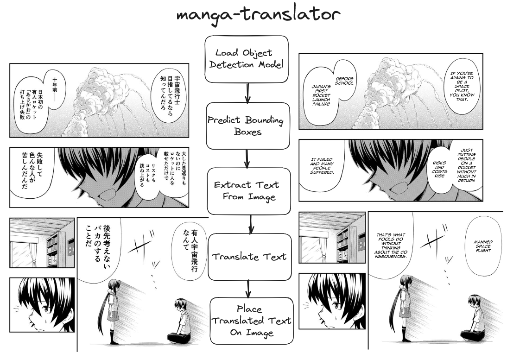

# Manga Translator

## Table of Contents

- [Introduction](#introduction)
- [Approach](#approach)
  - [Data Collection](#data-collection)
  - [Yolov8](#yolov8)
  - [Manga-ocr](#manga-ocr)
  - [Deep-translator](#deep-translator)
- [Server](#server)
- [Demo](#demo)

## Introduction

I love reading manga, and I can't wait for the next chapter of my favorite manga to be released. However, the newest chapters are usually in Japanese, and they are translated to English after some time. I want to read the newest chapters as soon as possible, so I decided to build a manga translator that can translate Japanese manga to English. (**NEW** I've added support for multiple languages, which include Arabic, Greek, Cyrillic and other non Latin languages.)

## Approach

I want to translate the text in the manga images from Japanese to English. I will first need to know where these speech bubbles are on the image. For this I will use `Yolov8` to detect the speech bubbles. Once I have the speech bubbles, I will use `manga-ocr` to extract the text from the speech bubbles. Finally, I will use `deep-translator` to translate the text from Japanese to English.



### Data Collection

This [dataset](https://universe.roboflow.com/speechbubbledetection-y9yz3/bubble-detection-gbjon/dataset/2#) contains over 8500 images of manga pages together with their annotations from Roboflow. I will use this dataset to train `Yolov8` to detect the speech bubbles in the manga images. To use this dataset with Yolov8, I will need to convert the annotations to the YOLO format, which is a text file containing the class label and the bounding box coordinates of the object in the image.

This dataset is over 1.7GB in size, so I will need to download it to my local machine. The rest of the code should be run after the dataset has been downloaded and extracted in this directory.

The dataset contains mostly English manga, but that is fine since I am only interested in the speech bubbles.

### Yolov8

`Yolov8` is a state-of-the-art, real-time object detection system [that I've used in the past before](https://github.com/Detopall/parking-lot-prediction). I will use `Yolov8` to detect the speech bubbles in the manga images.

### Manga-ocr

Optical character recognition for Japanese text, with the main focus being Japanese manga. This Python package is built and trained specifically for extracting text from manga images. This makes it perfect for extracting text from the speech bubbles in the manga images.

### Deep-translator

`Deep-translator` is a Python package that uses the Google Translate API to translate text from one language to another. I will use `deep-translator` to translate the text extracted from the manga images from Japanese to English.

## Server

I created a simple server and client using FastAPI. The server will receive the manga image from the client, detect the speech bubbles, extract the text from the speech bubbles, and translate the text from Japanese to English. The server will then send the translated text back to the client.

To run the server, you will need to install the required packages. You can do this by running the following command:

```bash
pip install -r requirements.txt
```

You can then start the server by running the following command:

```bash
python app.py
```

The server will start running on `http://localhost:8000`. You can then send a POST request to `http://localhost:8000/predict` with the manga image as the request body.

```json
POST /predict
{
  "image": "base64_encoded_image"
}
```

## Demo

The following video is a screen recording of the client sending a manga image to the server, and the server detecting the speech bubbles, extracting the text, and translating the text from Japanese to English.

[](https://www.youtube.com/watch?v=P0VZu4whrz4)
